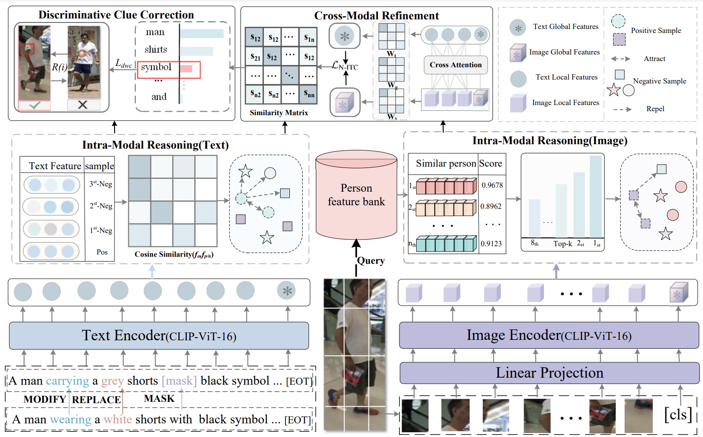

# MaBa: Cross-Modal Reasoning with Multi-level Alignment for Text-to-Image Person Retrieval

[](https://github.com/yourusername/MaBa/blob/main/LICENSE) 
[](https://paperswithcode.com/sota/nlp-based-person-retrival-on-cuhk-pedes?p=maba-cross-modal-reasoning-with-multi-level)

Official PyTorch implementation of the paper "MaBa: Cross-Modal Reasoning with Multi-level Alignment for Text-to-Image Person Retrieval"[[arXiv]](https://arxiv.org/abs/2410.21318)



## 🚀 Updates
- **(2024.02.20)** MaBa achieves new SOTA on three benchmark datasets!
- **(2024.02.15)** Code and model checkpoints released!


## 📦 Installation
### Requirements
- Python 3.8+
- PyTorch 1.12+
- 8 GPU with 24GB+ memory (e.g., RTX 3090/4090)

```bash
conda create -n maba python=3.8
conda activate maba
pip install torch torchvision --extra-index-url https://download.pytorch.org/whl/cu113
pip install -r requirements.txt
```


### Datasets
Download the following datasets: 
CUHK-PEDES dataset from [here](https://github.com/ShuangLI59/Person-Search-with-Natural-Language-Description) \
ICFG-PEDES dataset from [here](https://github.com/zifyloo/SSAN)\
RSTPReid dataset form [here](https://github.com/NjtechCVLab/RSTPReid-Dataset)

Organize them in the "data" directory as follows:
```
|-- dataset root dir/
|   |-- <CUHK-PEDES>/
|       |-- imgs
|            |-- cam_a
|            |-- cam_b
|            |-- ...
|       |-- reid_raw.json
|
|   |-- <ICFG-PEDES>/
|       |-- imgs
|            |-- test
|            |-- train 
|       |-- ICFG_PEDES.json
|
|   |-- <RSTPReid>/
|       |-- imgs
|       |-- data_captions.json
```

### Download Pretrained Weights
Download the pretrained CLIP weights for ViT-B/16 and ViT-L/14, and place them in the pretrained directory.

### Training
```bash
python train_scipt.py 
```
### Evaluation
```bash
python evaluate.py \
--checkpoint ./checkpoints/MaBa-B16_cuhk.pth \
--dataset CUHK-PEDES \
--visualize_results
```

### Results & Checkpoints

#### CUHK-PEDES dataset
|     Method      |     Backbone     |  Rank-1   |  Rank-5   |  Rank-10  |    mAP    |
| :-------------: | :--------------: | :-------: | :-------: |:---------:|:---------:|
|     CMMT      |    RN50/LSTM    |  57.10		  |     78.14    |   85.23   |     -     | 
|      SSAN       |    RN50/LSTM     |   61.50		  |   81.19  |   87.51   |     -     |
|  IVT    |  ViT-B-16/BERT   |   65.59   |   83.11  |   88.19   |     -     |     -     |
|      CFine				      | ViT-B-16/BERT  |   69.57   |   85.93   |   91.15   |     -     |
|       IRRA			  |  ViT-B-16   |   73.38	  |   89.93	  |   93.71   |   66.13   |
|      BiLMa				     |  ViT-B-16   |  74.03   |   89.59  |   93.62   |  	66.57   |
|    **CLIP**     | ViT-B-16|  66.54   |   86.94		 |   91.77   |   62.69   |
| **MaBa (Ours)** | ViT-B-16 | **** | **76.13** | **91.94** | **95.53** | **67.77** |


#### Citation
If you find this work useful, please cite our paper:
```bash
misc{kang2024multipathexplorationfeedbackadjustment,
      title={Multi-path Exploration and Feedback Adjustment for Text-to-Image Person Retrieval}, 
      author={Bin Kang and Bin Chen and Junjie Wang and Yong Xu},
      year={2024},
      eprint={2410.21318},
      archivePrefix={arXiv},
      primaryClass={cs.CV},
      url={https://arxiv.org/abs/2410.21318}, 
}
```
### ❤️Acknowledgement

This repository was built on top of [CLIP](https://github.com/openai/CLIP/blob/main/clip/model.py), [IRRA](https://github.com/anosorae/IRRA). We thank the effort from the community